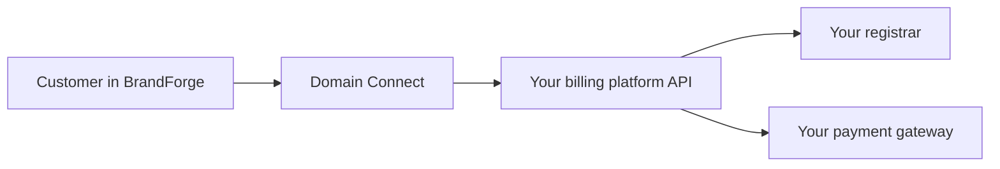

# Domain Connect

**Domain Connect** links your billing platform to BrandForge so your customers
can search, register, transfer, and protect domains directly inside your
BrandForge-powered storefront, while every order, invoice, and registration
happens in **your** billing system, under **your** registrar and **your**
pricing.

BrandForge never replaces your billing platform. It connects to it. You keep
full ownership of your customers, your margins, and your data.

## How it works

When a customer goes through the domain flow in BrandForge, Domain Connect talks
to your billing platform's API behind the scenes to:

- **Read your pricing** so customers always see your live prices, in the
  currencies you offer.
- **Check availability** in real time before an order is placed.
- **Create the customer** (or recognise a returning one) in your system.
- **Place the order and raise the invoice** in your billing platform.
- **Hand off to payment** using your active payment gateway.

The domains are registered through your own registrar, and the order appears in
your billing platform exactly as if the customer had ordered there directly.

## What you'll connect

Domain Connect supports the major billing platforms. Pick yours to get started:

- [WHMCS](./whmcs.md)
- [Blesta](./blesta.md)
- [Upmind](./upmind.md)
- [HostBill](./hostbill.md)

Building something custom or using a platform not listed here? See the
[Generic API](./api.md) page for the integration contract.

## What you'll need

Whichever platform you use, the setup follows the same shape:

1. **API credentials** from your billing platform, entered into BrandForge.
2. **Permissions** scoped so Domain Connect can read pricing and create orders.
3. **An IP allowance** so your platform accepts calls from the BrandForge server.
4. **Configured TLDs, currencies, and a payment gateway** in your platform.

Each platform page walks you through these steps in the exact order and wording
for that system.

## A note on security

Your API credentials are stored encrypted in BrandForge and are never shown
again after you save them. Domain Connect only ever uses the specific
permissions needed to read pricing and place orders. You can revoke access at
any time from your billing platform.

:::tip Connection test
After entering your details in BrandForge, always run **Test connection**. It
makes a harmless read-only call to confirm everything is wired up before a real
customer ever reaches checkout.
:::
